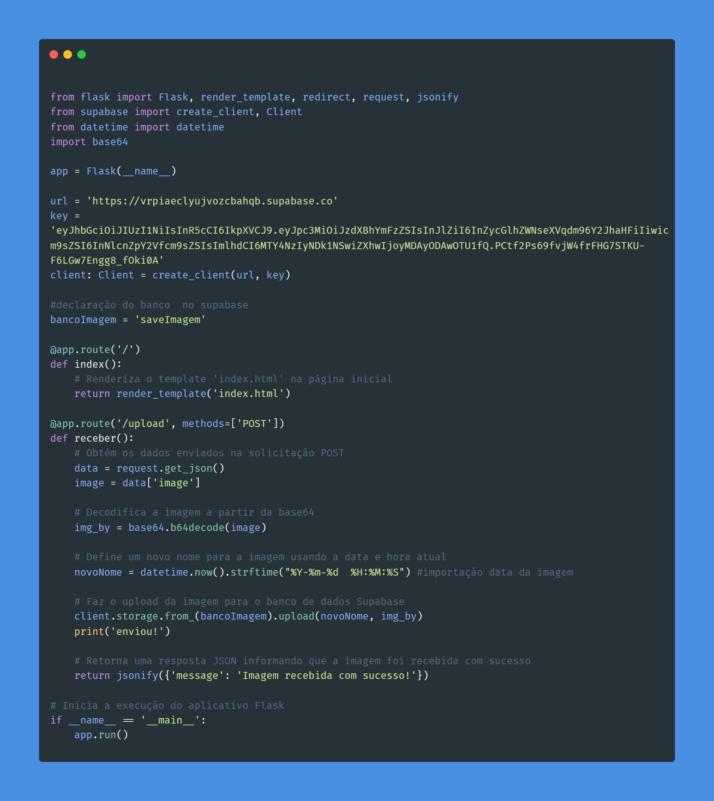

### Instituto de Tecnologia e Liderança.
# Armazenamento de imagem pelo Backend.
---

### Autor:

   Alysson Carlos de Castro Cordeiro.
---

---
### **Objetivo:** 

Desenvolver um backend para processamento de imagens que seja capaz de receber e armazenar imagens de forma adequada, utilizando tecnologia sem restrições.

Espera-se a capacidade demonstrável de desenvolvimento de um backend capaz de interagir (não necessariamente em tempo real) com um sistema de visão computacional. A entrega deve ser um vídeo demonstrando o funcionamento do projeto, um texto conciso descrevendo como foi feita a implementação e o link para o repositório público no github onde foi feita a implementação.

### **Linguagens usadas:**

1. Python.
2. JavaScript.

### **Tecnologias usadas:**

1. Flask.
2. Supabase.
3. Base64
4. Html/Css
   
### **Insatalando no ambiente:**

**Flask:**
O Flask é um framework web em Python usado para desenvolvimento de aplicações web. Ele é leve, simples e fácil de usar, o que o torna uma escolha popular para a criação de sites e serviços web.

1. criei um diretório e abra-o. Lá instale o Venv.
   (*siga o detalhe do tutorial abaixo.*)
(https://flask-ptbr.readthedocs.io/en/latest/installation.html#installation)

### **Desenvolvimento:**

Para alcançarmos nosso objetivo, iniciaremos criando um back-end capaz de suportar um front-end que permita o upload de imagens. Essas imagens serão processadas pelo OpenCV, que já está configurado com um modelo treinado para identificar rachaduras. Essa implementação será baseada no desenvolvimento do projeto ponderada 3.

Após a criação dos diretórios do Flask e a instalação adequada, foi criada uma pasta chamada "venv". Dentro dessa pasta, foi criado um arquivo Python chamado "app.py", que contém o código do nosso back-end da aplicação, incluindo suas regras de negócio (rotas).

---

Em resumo, o Front-end serve como interface para o usuário, permitindo que ele faça o upload de uma imagem. Essa imagem é transformada em base64 para facilitar o envio e, em seguida, é enviada para o Back-end através da rota '/upload'. No Back-end, a imagem passa por todo o processamento necessário e, por fim, é enviada para ser armazenada no banco de dados SupaBase.

.png)
---

O vídeo mostrando a funcionalidade da aplicação está no link abaixo:

(https://drive.google.com/file/d/1G9uJNpmQrgN5254SXlzfRO_MkakJmKsV/view?usp=sharing)